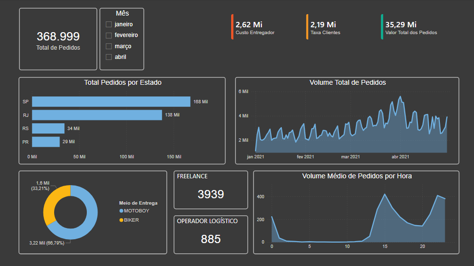
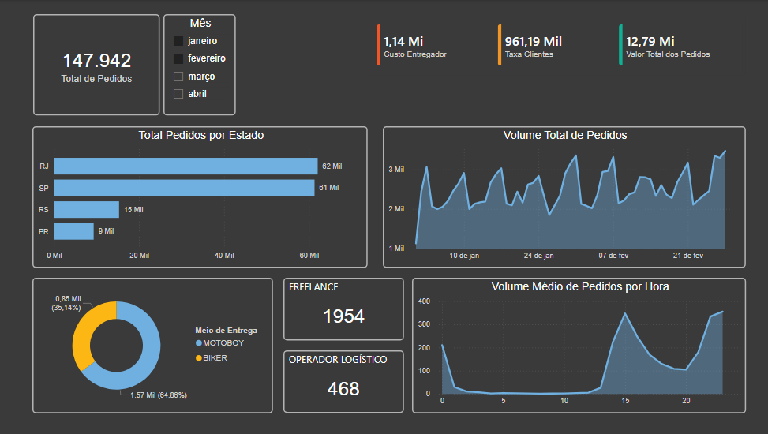
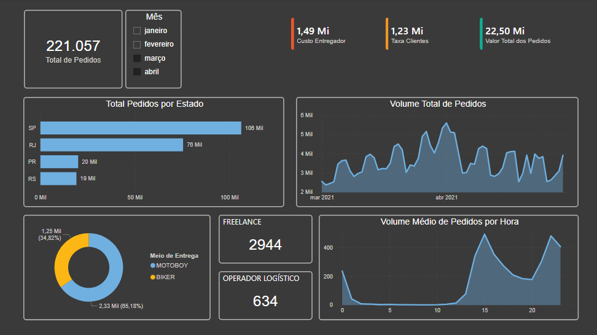

# Dashboard Power BI - Delivery Center

Dashboard interativo para análise operacional de pedidos de delivery no Brasil (jan-abr 2021).

## Sobre

Visualização de dados do dataset público "Delivery Center: Food & Goods orders in Brazil", com foco em evolução temporal, distribuição regional e padrões operacionais.

## Tecnologias

Power BI

---

## 📊 Visão Geral

Dashboard apresenta visão consolidada de 368.999 pedidos processados no período, com filtros interativos por mês e métricas operacionais.

---

## 🔍 Análises Temporais

### Janeiro e Fevereiro 2021

**Características do período:**
- **147.942 pedidos** processados
- **Rio de Janeiro liderava** em volume (62 mil pedidos vs 61 mil de SP)
- Custo entregador (valor pago ao entregador): R$ 1,14 Mi
- Taxa clientes (valor pago pelo cliente): R$ 961,19 Mil
- Valor total dos pedidos: R$ 12,79 Mi
- Padrão horário: picos entre 14h-16h e 21h-23h
- Meio de entrega: 64,86% Motoboy | 35,14% Biker

---

### Março e Abril 2021

**Mudanças observadas:**
- **221.057 pedidos** (+49% vs jan-fev)
- **Inversão regional:** São Paulo assume liderança (106 mil vs 76 mil do RJ)
- Crescimento operacional:
  - Custo entregador: R$ 1,49 Mi (+30%)
  - Taxa clientes: R$ 1,23 Mi (+28%)
  - Valor total dos pedidos: R$ 22,50 Mi (+76%)
  - Freelancers ativos: 2.944 (+50%)
  - Operadores logísticos: 634 (+35%)
- Meio de entrega: 65,18% Motoboy | 34,82% Biker (proporção estável)

**Insight principal:** Expansão acelerada da operação em mar-abr, com São Paulo consolidando posição como principal mercado. O crescimento de 49% no volume de pedidos foi acompanhado por expansão proporcional da força operacional e aumento expressivo de 76% no valor total processado.

---

## 📈 Principais Métricas

### Operacionais
- Volume total de pedidos por estado
- Distribuição temporal (evolução diária)
- Padrões de volume por hora do dia

### Financeiras
- Custo total com entregadores
- Taxa de pagamento dos clientes
- Valor total de pedidos

### Logísticas
- Distribuição por meio de entrega (Motoboy vs Biker)
- Quantidade de freelancers ativos
- Operadores logísticos envolvidos

---

## 🎯 Funcionalidades

- **Filtro temporal:** Seleção por mês (jan-abr 2021)
- **KPIs dinâmicos:** Métricas se ajustam automaticamente aos filtros
- **Análise regional:** Comparação entre estados
- **Padrões horários:** Identificação de picos de demanda

---

## 📦 Dataset

Delivery Center: Food & Goods orders in Brazil (Kaggle)

---

## 📧 Contato

**Vitor Fernando Pires Alves**  
- **Email:** vitor.fpiresalves@gmail.com
- **LinkedIn:** [linkedin.com/in/vitor-pires-alves](https://www.linkedin.com/in/vitor-pires-alves/)
